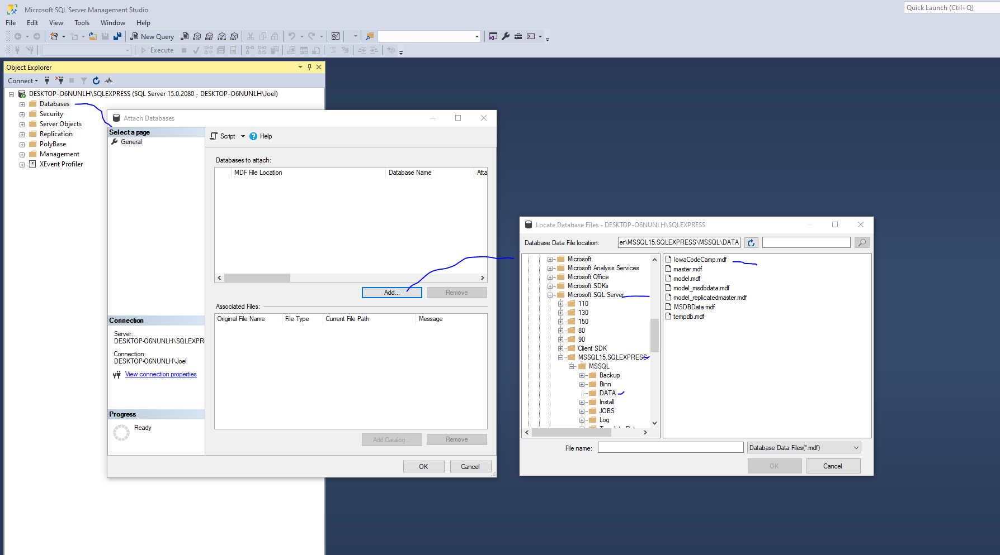
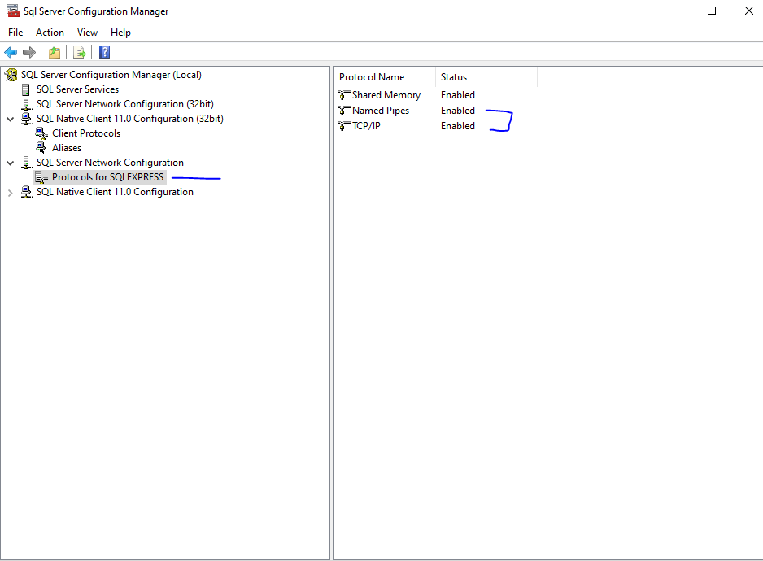
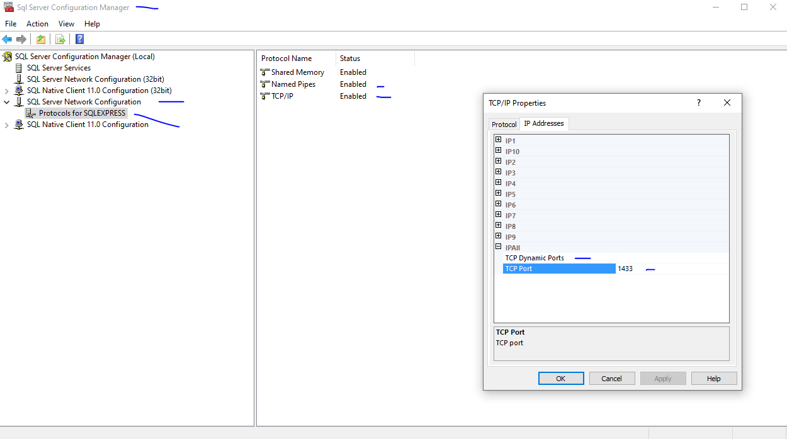

# Iowa Code Camp Database System API #

*iowacodecamp-database-sapi* is a system layer API used to support interfaces with the backend Iowa Code Camp website (http://iowacodecamp.com/) database written with Mulesoft 4 and MS SQL Server.

This application is setup with a basic set of initial services intended facilitate a realistic example of exercises we perform as developers at UFG (web development) and will be used for new hire and candidate interviews. It is based on the following problem posed to previous candidates to better understand their ability to be successful as a developer at UFG.

[The Code Camp Problem](README/TheCodeCampProblem.pdf)

## Getting Started ##

### Developer Tools ###

- If you don't already have your own personal Mulesoft developer account, sign up for one here: https://anypoint.mulesoft.com/login/. Open the support site here: https://help.mulesoft.com/user/profile, the enter here to download the latest Anypoint Studio IDE: https://help.mulesoft.com/s/downloads.

- Install maven https://maven.apache.org/download.cgi

- Install free JDK https://adoptopenjdk.net/

- Install SQL Server Express https://docs.microsoft.com/en-us/sql/database-engine/configure-windows/sql-server-express-localdb?view=sql-server-ver15

- Install SQL Server Management Studio https://docs.microsoft.com/en-us/sql/ssms/download-sql-server-management-studio-ssms?view=sql-server-ver15

- Install Postman https://www.postman.com/downloads/

### Database Setup ###

- Upgrade LocalDB data store (.mdf database file) with a newer version of SQL Express if necessary https://docs.microsoft.com/en-us/previous-versions/visualstudio/visual-studio-2015/data-tools/upgrade-dot-mdf-files?view=vs-2015&redirectedfrom=MSDN

- IowaCodeCamp.mdf backup database [file](https://github.com/joelcaspers/iowacodecamp-database-sapi/tree/master/src/main/resources/databasebackup/IowaCodeCamp.mdf) to copy and import into your local SQL Server Express instance.

- Using SQL Server Management Studio, in order to have access to import the .mdf file into your SQL Server Express instance, you must copy it into (for example) C:\Program Files\Microsoft SQL Server\MSSQL15.SQLEXPRESS\MSSQL\DATA folder and reference that folder from the import dialogue in SSMS. Right click on your instance's Databases folder and select "Attach...".

- Once you finish the SQL Server Management Studio attach database dialogs, open the Databases folder in the left pane of SQL Server Management Studio and rename the database by right clicking the newly imported database in the list and renaming it to IowaCodeCamp 

#### Enable Named Pipes and restart SQL Server Service: ####

- Open "SQL Server Configuration Manager" (the name may vary slightly depending on which version of SQL Server you have installed) on your local computer. To do this, click on Start, all programs, "Microsoft SQL Server (version), Configuration Tools", then you should see the "SQL Server Configuration Manager" window.

- Expand "SQL Server Network Configuration", Enable Named Pipes and TCP/IP in the right panel.

- In the right panel TCP/IP option right click and open Properties. In the dialog, open the IP Addresses tab. Scroll all the way to the bottom to "IPAll" section and blank out TCP Dynamic Ports, enter 1433 for TCP Port.

- Highlight "SQL Server Services" in the left panel. In the right window, right-click on "SQL Server (SQLEXPRESS)" and select "restart".

#### Enable Integrated Authentication for Mule API connection string for database connectors ####
- Mule API connection string configuration reference and setup of integrated authentication to the database https://help.mulesoft.com/s/article/How-to-use-Windows-Authentication-in-Database-Connector-with-Microsoft-SQL-Server-in-Mule4 - this has already been configured in the application, but you will need to download the referenced SQL .dll dependency and follow the instructions to copy it to your JDK folder (see Anypoint Studio properties to find the bundled JDK installed with Anypoint Studio).

### Anypoint Platform ###
- Replace the global-properties.xml iowacodecamp.database.url property value for the connection string 'instance' attribute with your own computer instance name, for example '{CPUNAME}\SQLEXPRESS' It will be displayed in your SQLEXPRESS instance in SQL Server Management Studio where you imported the example database.

- If you need to make specification changes, create a Design Center instance from your signed up Anypoint Platform account of iowacodecamp-database-sapi and copy the repo /src/main/resources/api folder and import it into your instance.

### Anypoint Studio Launch Configuration ###
- Ensure you add VM argument -M-Danypoint.platform.gatekeeper=disabled to the run/debug launch configuration. See launchconfig repo folder for an example launch configuration you can import and use in Anypoint Studio.

### Postman Examples ###
- Example services collection is provided in the postman repo folder

## The IowaCodeCamp.com Project Exercise ##
TODO list out background, expectations, reference the other project repositories, UI, etc

Potential Exercises:

build out speaker page/display section

build out schedule section

build out register for an event/conference

health check - provide request to set this up

client id/secret setup in API manager

traits

fix tests

refactor RAML - data types

reactor implementation

metadata

add session/speaker location data for UI map display

fix session missing properties

database schema cleanup
